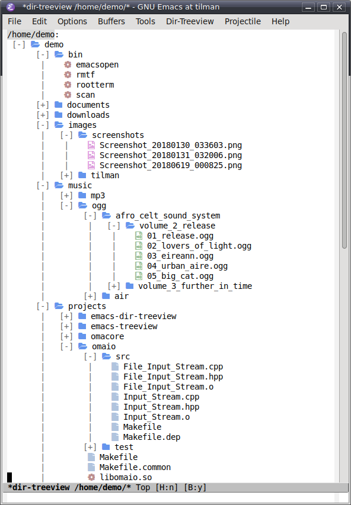
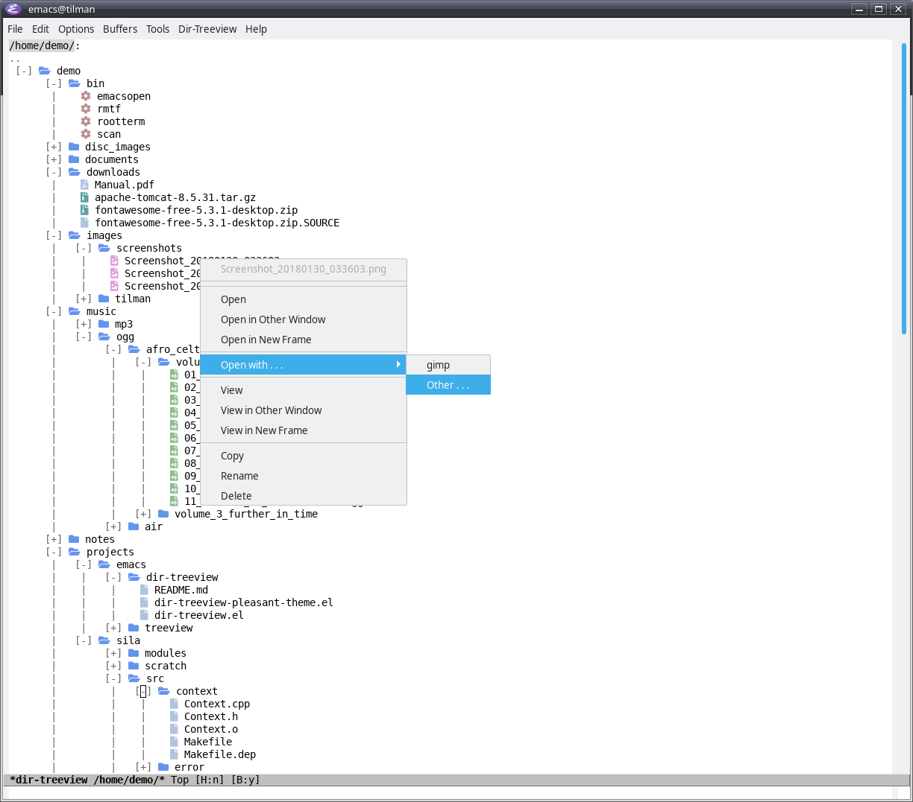
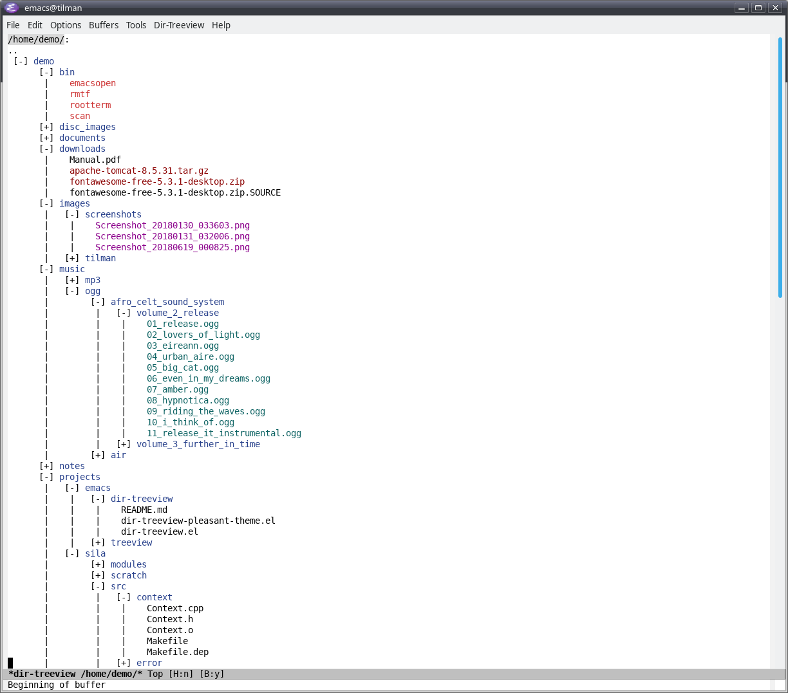
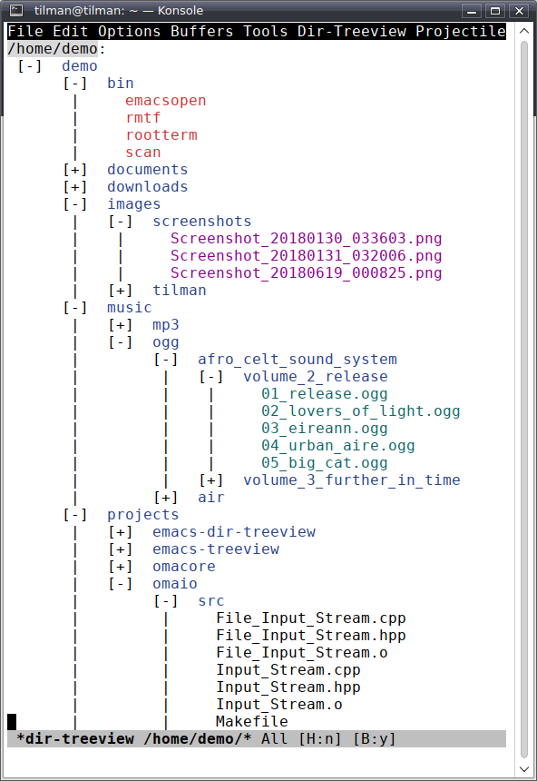
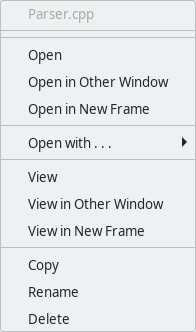
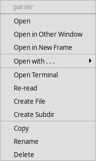
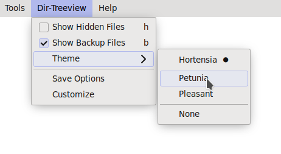
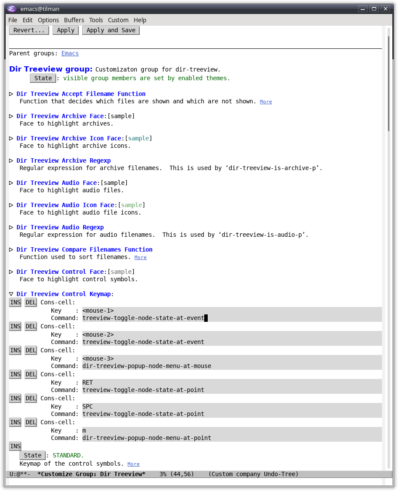

emacs-dir-treeview
==================

Emacs file system navigator and simple file manager.

This document describes v1.3.3 of emacs-dir-treeview.

* [Overview](#overview)
* [Screenshots](#screenshots)
* [Installation](#installation)
  * [From MELPA](#from-melpa)
  * [Manual installation](#manual-installation)
  * [Installation of the "Pleasant" theme](#installation-of-the-pleasant-theme)
  * [Post-installation setup](#post-installation-setup)
* [Usage](#usage)
  * [Start](#start)
  * [Current vs. side window](#current-vs-side-window)
  * [Navigating in the tree, with and without mouse](#navigating-in-the-tree-with-and-without-mouse)
  * [The context menu](#the-context-menu)
  * [Selection](#selection)
  * [Key bindings](#key-bindings)
* [Themes](#themes)
  * [Enabling themes](#enabling-themes)
* [File notifications](#file-notifications)
* [Customization](#customization)
* [Troubleshooting](#troubleshooting)
  


Overview
--------

* Displays the file system as a tree; subtrees can be folded and unfolded
* A click on a filename loads the file in Emacs
* A right-click opens a context menu with further actions
* Can open files by external programs or Lisp functions
* Can open terminal in directory
* Can copy, delete, and move files
* Can change file modes (i.e., permissions, executability, etc.) and file ownerships
* Provides selection of multiple files to operate on them
* Works in text mode, too
* Supports file notifications
* Highly customizable
* Themable
* Ships with a theme called "Pleasant" using Font Awesome icons
* More themes can be found at [emacs-dir-treeview-themes](https://github.com/tilmanrassy/emacs-dir-treeview-themes)


Screenshots
-----------

#### Theme 'Pleasant'


#### Context dialog


#### Without theme


#### Text modus



Installation
------------

### From MELPA

Dir-treeview is available on [MELPA](https://melpa.org/). Provided MELPA is configured in your Emacs
(see [here](https://melpa.org/#/getting-started) for more information), you can install dir-treeview by typing:

```
    M-x package-install RET dir-treeview RET
```

### Manual installation

As a prerequisite, install [emacs-treeview](https://github.com/tilmanrassy/emacs-treeview).

Copy the file dir-treeview.el to somewhere in the load path. Optionally, byte-compile the
file. Add the following to your `init.el`:

```elisp
    (require 'dir-treeview)
```


### Installation of the "Pleasant" theme

Make sure the "Font Awesome" icon font is installed on your computer.

If you installed dir-treeview from MELPA, there is nothing else to do. If you installed dir-treeview manually, copy
the file `dir-treeview-pleasant-theme.el` to somewhere in the theme load path (cf. Lisp variable `custom-theme-load-path`).

To enable the theme, see [Enabling themes](#enabling-themes).


### Post-installation setup

Bind a key, for example F9, to the command `dir-treeview` by adding the following
to your `init.el`:

```elisp
    (global-set-key (kbd "<f9>") 'dir-treeview)
```

If you installed dir-treeview manually, this statement must occur after the `(require 'dir-treeview)` statement above.

    
Usage
-----

### Start

The normal way to start dir-treeview is by the command `dir-treeview`. This is why we recommended to bind
a key to it in the "Installation" section above. It shows the tree originating at your home
directory. If you want to start dir-treeview with a different origin, use the command `dir-treeview-open`. It
will ask for the origin directory in the minibuffer:

```
    M-x dir-treeview-open RET <directory> RET
```

The first line of the dir-treeview buffer shows the origin of the tree. The symbol `..` in the second line represents the parent directory. A click on the symbol displays the tree of the parent directory. Below that the actual tree starts.

The major mode of the buffer is `dir-treeview-mode`.


### Current vs. side window

By default, dir-treeview uses the current window to display the tree. However, it is also possible to display the
tree in a side window (cf. [Side Windows](https://www.gnu.org/software/emacs/manual/html_node/elisp/Side-Windows.html "Side Windows - GNU Emacs Lisp Manual") in the Emacs Lisp Manual). Thic can be controlled by the customizable variable `dir-treeview-show-in-side-window`.

### Navigating in the tree, with and without mouse

Navigating in the tree with the mouse is straight forward. A left click on the `[+]` or `[-]` symbols expand or collapse the respective directory. A left click on a filename opens the respective file in Emacs. A left click on the  `..` symbol atop the first node switches to the tree originating at the parent directory.

It is possible to navigate in the tree completely without the mouse, only with the keyboard:

* The up and down arrow keys jump to the previuos or next node, respectively. The point (cursor) is placed on the `[+]` resp. `[-]` symbol if the node is a directory, and on the filename otherwise.
* The `SPACE` key expands/collapses the respective directory if the point is on a `[+]`/`[-]` symbol.
* The `RETURN` key expands/collapses the respective directory if the point is on a `[+]`/`[-]` symbol.
* The `RETURN` key opens the respective file in Emacs if the point is on a filename.
* The `RETURN` key switches to the tree of the parent node if the point is on the  `..` symbol atop the first node.

### The context menu

This section describes the context menu of unselected nodes. Selection and its effect on the context menu is described in the next section.

A right-click on an node opens the nodes's context menu. Alternativly, the context menu can be opened with the `e` key when the point is on a node. The menu looks different depending on whether the node is a directory or not:

#### Non-directory-file:


#### Directory:


Most of the menu items should be self-explanatory.

The `Open with...` item opens a submenu with external programs or Lisp functions to open the file.

The `Open Terminal` item opens a shell in terminal program at the corresponding directory.

Both the context menu and the `Open with...` submenu are customizable.

### Selection

#### Selecting and unselecting files

To select a file, click the filename while holding the control key pressed (`<C-mouse-1>`), or move the point to the line of the file and type `a`. The same unselects the file if it is selected, thus, `<C-mouse-1>` and `a` actually toggle selection. You can select as many files as you want. Selected files are highlighted in the customizable face `dir-treeview-select-face`.

You can also select a region of successive files at once: First, select the topmost file. Then, click the last file while holding the shift key pressed (`<S-mouse-1>`), or move the point to the line of the last file and type `A`.

To unselect all files, simply press `C-g`.

#### Operations on selected files

The following operations can be done on the selected files:

* Copying all selected files
* Moving all selected files
* Deleting all selected files
* Opening all selected files in Emacs
* Open all selected files with an external program

To copy or move the selected files, navigate to the destination (which must be a directory), and open its context menu (right-click or `e`). The context menu offers one item for moving and one for copying the selected files to the destination directory.

For the other three operations (deleting, opening in Emacs, opening with an external program), open the context menu of one of the selected files. The context menu consists of three items, one for each of the three operations.

### Key bindings

As usual in Emacs, dir-treeview activates a special local keymap in its buffers (cf. [Local Keymaps](https://www.gnu.org/software/emacs/manual/html_node/emacs/Local-Keymaps.html "Local Keymaps - GNU Emacs Manual") in the Emacs Manual). Besides this, dir-treeview defines three additional keymaps which are only active in particular places of the buffer: the *control keymap* inside the `[+]`/`[-]` symbols, the *label keymap* inside the filenames of the nodes, and the *parent dir keymap* inside the  `..` symbol atop the first node. The following tables list the default key bindings of the keymaps:


#### Local keymap

Key         | Action
------------|-------------------------------------------
`<down>`    | Move to next node
`<up>`      | Move to previuos node
`C-<down>`  | Move to last sibling
`C-<up>`    | Move to first sibling
`.`         | Reload node
`=`         | Reload entire tree
`d`         | Delete file or directory
`DEL`       | Delete file or directory
`c`         | Copy file or directory
`C`         | Copy selected files to directory at point
`r`         | Rename file or directory
`M-m`       | Change file mode (permissions, executability, etc.)
`M-o`       | Change file owner (requires root privileges)
`t`         | Open terminal
`f`         | New file
`s`         | New directory
`i`         | Show file info in echo area
`a`         | Toggle selection
`A`         | Select successive files (cf. [Selecting and unselecting files](#selecting-and-unselecting-files))
`h`         | Toggle show hidden files
`b`         | Toggle show backup files


#### Control keymap

Key         | Action
------------|---------------------
`<mouse-1>` | Expand/collapse node
`<mouse-2>` | Expand/collapse node
`<mouse-3>` | Open context menu
`RET`       | Expand/collapse node
`SPC`       | Expand/collapse node
`e`         | Open context menu

#### Label keymap

Key           | Action
--------------|------------------------
`<mouse-1>`   | Open file in Emacs
`<mouse-2>`   | Open file in Emacs
`<mouse-3>`   | Open context menu
`RET`         | Open file in Emacs
`e`           | Open context menu
`<C-mouse-1>` | Toggle selection
`<S-mouse-1>` | Select successive files (cf. [Selecting and unselecting files](#selecting-and-unselecting-files))


Themes
------

Dir-treeview commes with a theme called "Pleasant". It uses Font Awesome icons. More themes can be found at
[emacs-dir-treeview-themes](https://github.com/tilmanrassy/emacs-dir-treeview-themes).

### Enabling themes

The way themes are enabled has changed in version 1.3.0. The old method (prior to version 1.3.0) should still work, but
it is recommended to use the new method. The new method comes in two variants:

**Variant 1: By the menu bar.** In a dir-treeview buffer, the menu bar contains an additional menu "Dir-Treeview". It
contains a submenu "Theme" which allows you to choose the theme. The theme is applied immediately. Note that the new
theme is only set for the current Emacs session. To save it for future sessions, choose "Save options" from the 
"Dir-Treeview" menu. Here is a screenshot:



**Variant 2: By command in the minibuffer.** The is the more "classical" method. It also works in a non-graphical environment.
Type
```
    M-x dir-treeview-load-theme <return>
```
and enter the theme name. You are assisted by `tab` completion. After finishing with `return`, the new theme is applied
immediately. As above, the new theme is only set for the current Emacs session. To save it for future sessions, type:
```
    M-x dir-treeview-save-theme <return>
```

**Old method (prior to v1.3.0): By load-theme in Emacs init file.** Dir-treeview themes are based on the Emacs theme framework (cf.
[Custom Themes](https://www.gnu.org/software/emacs/manual/html_node/emacs/Custom-Themes.html "Custom Themes - GNU Emacs Manual")
in the Emacs Manual). They are special Emacs themes. As such, they can be loaded and enabled by the `load-theme` command.
`load-theme` expects the Lisp symbol of the theme as first argument. You get the Lisp symbol from the theme name as follows: convert
everything to lower case, replace whitespaces by dashes (consecutive whitespaces by a single dash), and add `dir-treeview-`. For example,
if the theme name is "Foo Bar 2", the Lisp symbol is `dir-treeview-foo-bar-2`. You should place the `load-theme` command in your `init.el`
file. For example, to enable the "Pleasant" theme, add the following to your `init.el`:

```elisp
    (load-theme 'dir-treeview-pleasant t)
```

If you installed dir-treeview manually, this statement must occur after the `(require 'dir-treeview)`
(cf. [Manual installation](#manual-installation)).

If you use the new method, the theme saved for future sessions is stored in the file `dir-treeview-theme.txt` in the user Emacs directory
(usually `~/.emacs.d`). You'll hardly need to access this file directly.


File notifications
------------------

If the operating system provides file watching, dir-treeview can make use of this feature to get notified if a file is
changed outside Emacs and update the tree accordingly (cf. [Notifications on File Changes](https://www.gnu.org/software/emacs/manual/html_node/elisp/File-Notifications.html#File-Notifications "File-Notifications - GNU Emacs Lisp Manual") in the Emacs Lisp Manual).
For example, if a new file is created outside Emacs, a corresponding node shows up automatically without the need to
refresh the tree manually.

File notifications are switched on by default. If you don't like that, change the customizable variable
`dir-treeview-use-file-watch` to the value `nil`. You do so by typing
```
    M-x customize-variable RET dir-treeview-use-file-watch RET
```
File notifications can also be switched on and off manually by typing

```
    M-x dir-treeview-switch-on-file-watch RET
```
and

```
    M-x dir-treeview-switch-off-file-watch RET
```
respectively.


Customization
-------------

Dir-treeview uses [Emacs' Easy Customization](https://www.gnu.org/software/emacs/manual/html_node/emacs/Easy-Customization.html#Easy-Customization "Easy Customization Interface - GNU Emacs Manual") system. The customization group is "dir-treeview". Type

```
    M-x customize-group RET dir-treeview RET
```
The customization buffer for dir-treeview opens and a list of settings
is displayed. You can change each setting interactively in the buffer. For example, to change the key bindings of the `[+]`/`[-]` symbols,
open the "Dir Treeview Control Keymap" entry by clicking on the small triangle left to it. You will see the following:



You can now add or remove keys or change the Lisp commands bound the them.


Troubleshooting
---------------

If the tree seems to be incorrect, outdated or broken, hit the `=` key. This runs the command `treeview-refresh-tree`, which recreates the
whole tree and (hopefully) fixes the problems.


